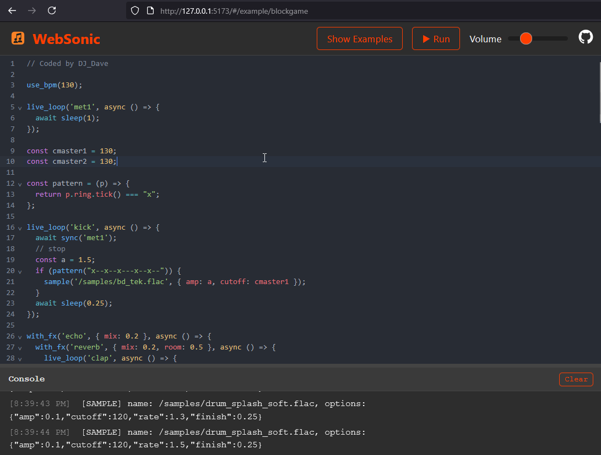

# WebSonic

WebSonic is a web-based, live-coding music environment inspired by the amazing [Sonic Pi](https://sonic-pi.net/). It brings the joy of creating music with code to the browser, using the Web Audio API for sound synthesis and Svelte for a reactive user interface.

It is still a toy project in early stages just to play with the audio api and gemini-cli. expect lots of bugs :x



NB: all samples comes directly from [Sonic PI samples](https://github.com/sonic-pi-net/sonic-pi/tree/dev/etc/samples) and examples are direct translations of [Sonic PI examples](https://github.com/sonic-pi-net/sonic-pi/tree/dev/etc/examples) to js

## Features

- **Live Coding:** Write and modify code on the fly and hear your changes instantly.
- **Concurrent Loops:** Run multiple musical patterns at the same time for complex compositions.
- **Built-in Synths and Samples:** A variety of synthesizers and drum samples are included out of the box.
- **Sonic Pi-inspired API:** A familiar and expressive API for creating music with code.
- **Resizable Code Editor and Console:** A comfortable and customizable coding environment.
- **BPM and Volume Control:** Easily control the tempo and volume of your music.

## Getting Started

### Prerequisites

- [Node.js](https://nodejs.org/) (v16 or higher)
- [npm](https://www.npmjs.com/)

### Installation

1.  Clone the repository:
    ```bash
    git clone https://github.com/your-username/websonic.git
    ```
2.  Navigate to the project directory:
    ```bash
    cd websonic/websonic
    ```
3.  Install the dependencies:
    ```bash
    npm install
    ```

### Running the Development Server

To start the development server, run the following command:

```bash
npm run dev
```

This will start the application on `http://localhost:5173`.

## How to Use

WebSonic provides a simple yet powerful API for creating music. Here are some of the key functions:

- `play(note, options)`: Plays a note with the current synthesizer.
- `sleep(beats)`: Pauses the current loop for a number of beats.
- `use_synth(synth_name)`: Changes the current synthesizer.
- `use_bpm(bpm)`: Sets the tempo of the music.
- `sample(sample_name)`: Plays a pre-defined sample.
- `loop(() => { ... })`: Creates a new concurrent loop.

### Example

```javascript
// Welcome to WebSonic!
use_bpm(120);

// A loop for the drums
loop(() => {
  sample('kick');
  sleep(0.5);
  sample('snare');
  sleep(0.5);
});

// A separate loop for the melody
loop(() => {
  use_synth('sawtooth');
  play(rrand(60, 72), { release: 0.2 });
  sleep(0.25);
});
```

## Available Synths

- `sine`
- `square`
- `sawtooth`
- `triangle`

## Available Samples

- `kick`
- `snare`
- `hat`

## Contributing

Contributions are welcome! Please feel free to open an issue or submit a pull request.

## License

This project is licensed under the MIT License.